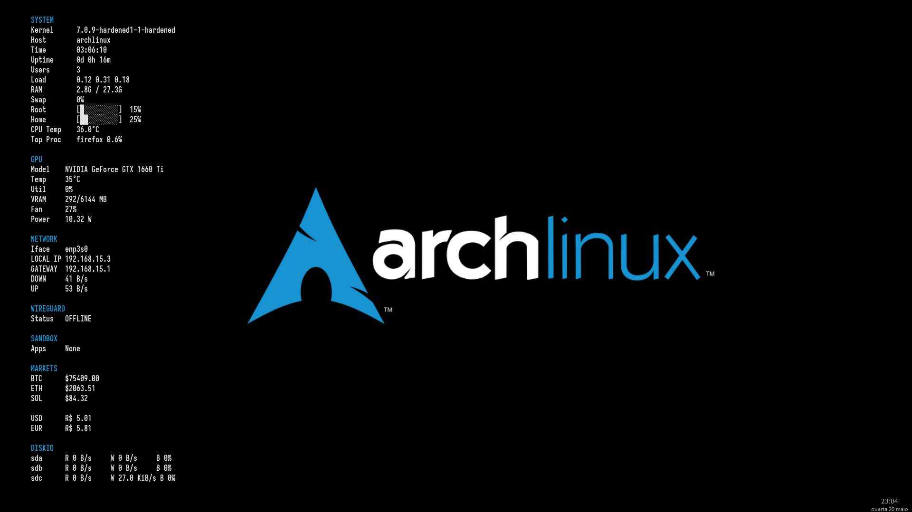

# NyxHud

Minimal X11 desktop HUD for Linux.



## Features

* Lightweight
* Modular collectors
* Shell-based telemetry pipeline
* Python renderer
* No telemetry
* No cloud services
* Low overhead

## Architecture

```text
Collectors
    ↓
nyx-collectord.sh
    ↓
Renderer
    ↓
X11 Overlay
```

## Font

NyxHud is designed around **Iosevka Term** for compact spacing, high readability and terminal-oriented rendering.

Recommended:

```text
Iosevka Term 12
```

Official resources:

* https://typeof.net/Iosevka/
* https://github.com/be5invis/Iosevka

## Dependencies

Arch Linux:

```sh
sudo pacman -S \
    bash \
    coreutils \
    gawk \
    grep \
    sed \
    procps-ng \
    iproute2 \
    curl \
    jq \
    python \
    python-gobject \
    gtk3
```

Optional:

```sh
sudo pacman -S \
    picom \
    lm_sensors \
    wireguard-tools \
    nvidia-utils \
    firejail
```

## Installation

```sh
git clone https://github.com/fm4lloc/nyxhud.git
cd nyxhud

find src -type f \( -name "*.sh" -o -name "*.py" \) -exec chmod +x {} \;
```

## Running

```sh
./src/start.sh
```

## License

GPL-3.0-or-later

## Author

Fernando Magalhães
