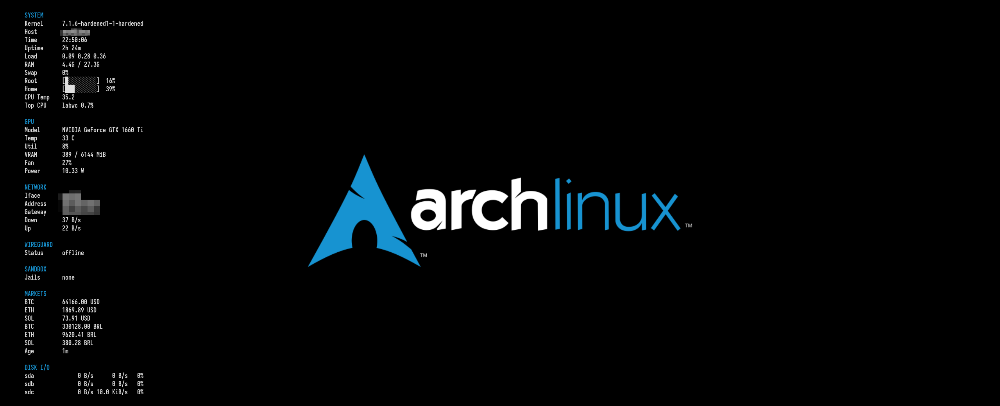

# NyxHUD

Modular HUD for Wayland compositors compatible with `wlr-layer-shell`.

It is not a widget framework, a plugin system, nor a monolithic daemon: it is two independent programs that communicate only via text files published in a private directory. Each collector runs, publishes exactly one block, and exits; the renderer reads the blocks and draws. Neither side knows the implementation of the other.



## Architecture

```text
        ┌──────────────┐
        │  Collectors  │   run, publish, and exit
        └──────────────┘
                │  atomic publishing
                ▼
   $XDG_RUNTIME_DIR/nyxhud/render/*.render
                │
                ▼
        ┌──────────────┐
        │   Renderer   │   only draws
        └──────────────┘
```

The flow is unidirectional. Collectors do not talk to each other and the renderer never executes them. Between collectors and renderer there is no custom communication protocol, RPC, D-Bus, or shared library — the only public interface of the project is the set of `.render` files.

## Why files?

Using text files as an interface reduces coupling between components and eliminates internal protocols, APIs, and shared libraries. It also allows:

- inspecting any block with `cat`, `less`, or `tail`;
- implementing collectors in any language;
- replacing or restarting modules individually;
- debugging each component in isolation;
- publishing atomically via `rename()`.

To the renderer, a published block is just text. Its origin is irrelevant.

## Features

- Native Wayland via `wlr-layer-shell`
- Decoupled collectors, without plugins and without dependency between modules
- Atomic publishing via `rename()`
- Private directories in `0700`, `umask 077`
- Temporary state in `tmpfs`; only the markets cache is persistent
- Configuration via environment variables, no configuration file
- POSIX shell, tested under `dash`
- Local failure never interrupts the other modules

## Installation

Requires a compositor that implements `wlr-layer-shell`: sway, labwc, river, Hyprland, or Wayfire. GNOME Shell is not supported.

```sh
git clone https://github.com/fm4lloc/nyxhud.git
cd nyxhud
./start.sh
```

`start.sh` brings up the renderer, the collector manager, and prepares the environment in `$XDG_RUNTIME_DIR`.

## Dependencies

Mandatory: Python 3, PyGObject, GTK 3, gtk-layer-shell (library and typelib), POSIX `/bin/sh`, coreutils, awk, and a monospace font with the characters `U+2588` and `U+2591` — by default `Iosevka Term`.

Optional, used by one collector each:

| Tool | Collector |
|---|---|
| `iproute2` | network |
| `lm_sensors` | temperature |
| `nvidia-utils` | NVIDIA GPU |
| `firejail` | sandbox |
| `curl` and `jq` | markets |

If the tool is missing, only the corresponding collector reports the problem on the screen. The others continue normally.

### Default font

The renderer uses **Iosevka Term 12** by default. It was chosen for its readability at small sizes, consistent monospace alignment, and for covering the block characters the HUD draws: `U+2588` (`█`) and `U+2591` (`░`).

- GitHub: <https://github.com/be5invis/Iosevka>
- Site: <https://typeof.net/Iosevka/>

Any monospace font containing these characters can be used.

To change the renderer's default font, edit the definition in `main/nyx-renderer.py`:

```python
FONT = os.environ.get("NYXHUD_FONT", "Iosevka Term 12")
```

## Modules

The blocks appear in the order of the collector's file name: renumbering a file reorders the HUD, with nothing else to change.

| File | Description |
|---|---|
| `01_system.sh` | kernel, hostname, time, uptime, load, memory, swap, partitions, temperature, and highest CPU consuming process |
| `02_gpu.sh` | NVIDIA model, temperature, utilization, VRAM, fan speed, and consumption |
| `03_network.sh` | default interface, IPv4 address, gateway, download, and upload |
| `04_wireguard.sh` | tunnel state, interface, and transfer rate |
| `05_sandbox.sh` | running Firejail sandboxes |
| `06_markets.sh` | BTC, ETH, and SOL in USD and local currency |
| `07_diskio.sh` | read, write, and occupancy per device |

To disable a module, remove execution permission:

```sh
chmod -x main/collectors/06_markets.sh
```

The supervisor notices the change in the next cycle and removes the block from the screen. No other file needs to change and nothing needs to be restarted.

## Configuration

No configuration file. Everything is an environment variable, read only at startup — changing any value requires restarting NyxHUD.

| Variable | Default | Description |
|---|---|---|
| `NYXHUD_FONT` | `Iosevka Term 12` | renderer font |
| `NYXHUD_TEXT_COLOR` | `#E0E0E0` | text color |
| `NYXHUD_TITLE_COLOR` | `#1793D1` | title color |
| `NYXHUD_ANCHOR` | `bottom-left` | screen corner |
| `NYXHUD_MARGIN` | `40` | outer margin |
| `NYXHUD_PADDING` | `24` | internal padding |
| `NYXHUD_OUTPUT` | automatic | monitor connector, e.g., `DP-1` |
| `NYXHUD_TTL` | `15` | validity of a block, in seconds |
| `NYXHUD_TIMEOUT` | `10` | maximum execution time for a collector |
| `NYXHUD_RUNTIME_DIR` | `$XDG_RUNTIME_DIR/nyxhud` | runtime directory, absolute path |
| `NYXHUD_CACHE_DIR` | `$XDG_CACHE_HOME/nyxhud` | persistent cache, absolute path |
| `NYXHUD_MARKETS` | `on` | any other value disables the markets collector |
| `NYXHUD_MARKETS_REFRESH` | `14400` | interval between API queries |
| `NYXHUD_MARKETS_FIAT` | `brl` | local currency, three letters |
| `NYXHUD_SANDBOX_MAX` | `8` | maximum number of displayed sandboxes |
| `NYXHUD_DISK_RE` | see below | regex for monitored devices |

Default for `NYXHUD_DISK_RE`, covering SATA, NVMe, eMMC, virtio, Xen, MD, and device-mapper:

```text
^(sd[a-z]+|nvme[0-9]+n[0-9]+|mmcblk[0-9]+|vd[a-z]+|xvd[a-z]+|md[0-9]+|dm-[0-9]+)$
```

```sh
NYXHUD_FONT="JetBrains Mono 11" NYXHUD_TITLE_COLOR="#8EC07C" NYXHUD_ANCHOR=top-right NYXHUD_OUTPUT=DP-1 ./start.sh
```

## Block validity

Publishing is the only sign of life. The renderer displays a block as long as its age is less than `NYXHUD_TTL` and hides it when the collector stops publishing.

Keep `INTERVAL ≤ NYXHUD_TTL / 2` so that each block is republished at least twice before expiring; above that, it flashes.

## Network access

All collectors use only `/proc`, `/sys`, and local tools, with one exception: `06_markets.sh` queries the public CoinGecko API every four hours, exposing the IP address and request time.

```sh
NYXHUD_MARKETS=off ./start.sh
```

## Security model

- atomic publishing: temporary file in the destination directory, followed by `rename()`
- private directories in `0700` and `umask 077` across all components
- removal of control characters upon publishing and again upon reading
- refusal of symbolic links in the runtime directories and `O_NOFOLLOW` when reading blocks
- single instance via lock directory, with stale lock recovery
- `timeout` per collector: a stalled module does not interrupt the others
- renderer and collectors isolated, no interface other than files

## Creating a module

A collector is an executable that writes a block and exits. The first line is the title.

```sh
#!/bin/sh

INTERVAL=5

set -u
set -f
LC_ALL=C
export LC_ALL
umask 077

NAME=battery

: "${NYXHUD_RENDER_DIR:?}"

publish() {
    tmp=$(mktemp "$NYXHUD_RENDER_DIR/.$NAME.XXXXXX") || exit 1

    trap 'rm -f -- "$tmp"' EXIT INT TERM

    if tr -d '\000-\010\013-\037\177' > "$tmp"; then
        mv -- "$tmp" "$NYXHUD_RENDER_DIR/$NAME.render"
    fi
}

read -r LEVEL < /sys/class/power_supply/BAT0/capacity

{
    printf 'BATTERY\n'
    printf 'Level       %s%%\n' "$LEVEL"
} | publish
```

Save as `main/collectors/NN_name.sh` and give execution permission. The supervisor detects created, removed, renumbered files or those with changed permissions in the next cycle — there is no registry and no restart is needed. Changing the `INTERVAL` of an already loaded module is the only change that requires a restart.

Treat the published `.render` as immutable: never edit the file in place, always write a new temporary one and replace the previous one with `rename()`.

Official modules conventions:

- publish using `mktemp` in the destination directory and `mv` over the target;
- remove control characters before publishing;
- validate integers before arithmetic expansion — under `dash`, `$(( ))` with a non-numeric operand aborts the script;
- use `/proc/uptime` for rate calculation, never `date +%s`;
- never write to the file published by another collector.

## Structure

```text
.
├── main
│   ├── collectors
│   │   ├── 01_system.sh
│   │   ├── 02_gpu.sh
│   │   ├── 03_network.sh
│   │   ├── 04_wireguard.sh
│   │   ├── 05_sandbox.sh
│   │   ├── 06_markets.sh
│   │   └── 07_diskio.sh
│   ├── nyx-collectord.sh
│   └── nyx-renderer.py
└── start.sh
```

## Limitations

Requires a compositor with `wlr-layer-shell`; GNOME Shell and environments without the protocol are not supported, nor is remote rendering. The project also assumes a file system where `rename()` within the same directory is atomic.

The highest CPU consuming field displays `idle` on the first read after startup, as it depends on two samples.

The GPU collector covers only NVIDIA adapters and reports only the first adapter returned by `nvidia-smi`; the WireGuard one, only the first detected interface. Network and disk rates are displayed in bytes per second, and the disk `busy` field is the fraction of time the device had in-flight I/O, not its capacity utilization.

`NYXHUD_TIMEOUT` is only applied when `timeout(1)` is installed; without it, collectors run without limits and the supervisor warns at startup. `NYXHUD_OUTPUT` depends on how the compositor identifies the monitor, which varies between implementations. The `05_sandbox.sh` parser follows the textual format of `firejail --list`, which has changed between versions.

## License

GPL-3.0-or-later. See `LICENSE`.